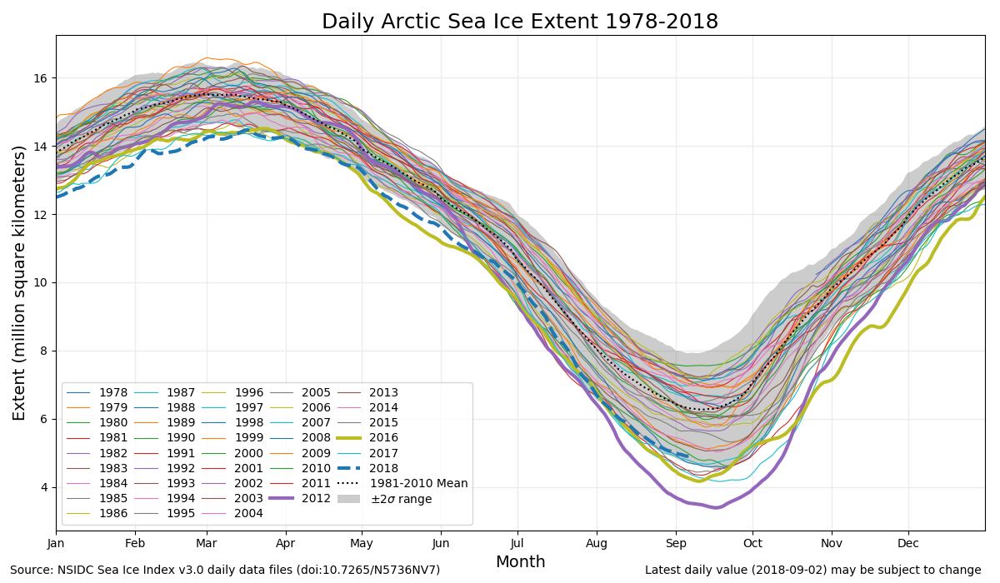
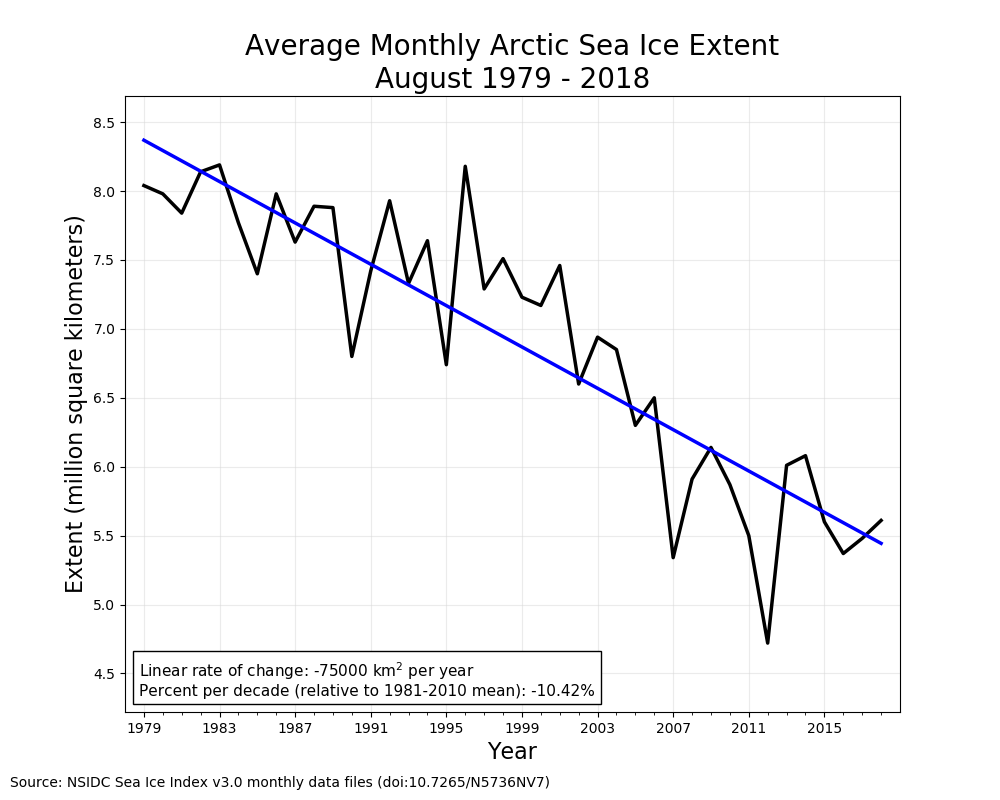
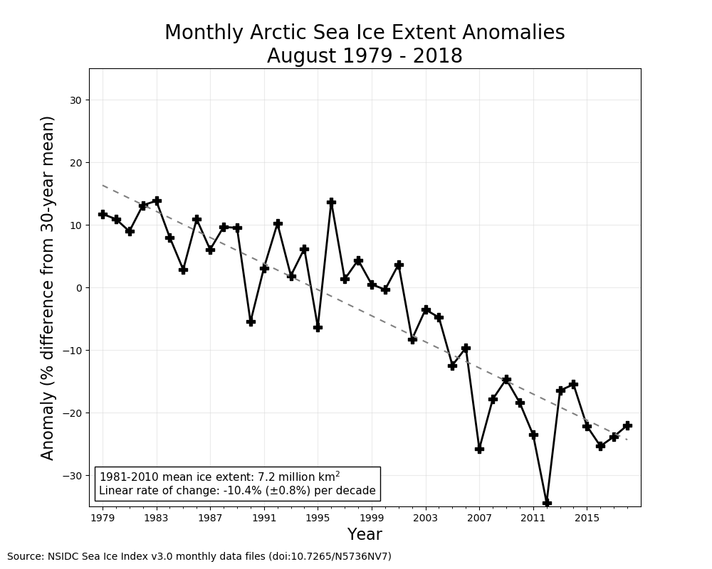
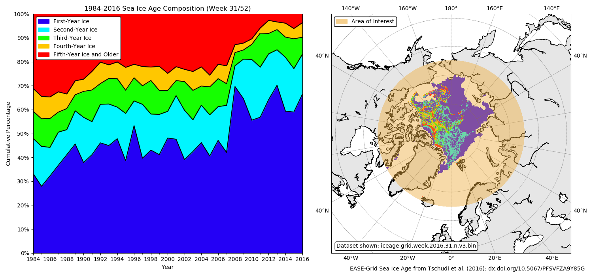

# nsidc-tools
## Source Dataset Citations
#### Daily and Monthly Sea Ice Index Data (NSIDC ID: G02135)
Fetterer, F., K. Knowles, W. Meier, M. Savoie, and A. K. Windnagel. 2017, updated daily. Sea Ice Index, Version 3. Boulder, Colorado USA. NSIDC: National Snow and Ice Data Center. doi: http://dx.doi.org/10.7265/N5K072F8. 
#### EASE-Grid Sea Ice Age Data (NSIDC ID: NSIDC-0611)
Tschudi, M., C. Fowler, J. Maslanik, J. S. Stewart, and W. Meier. 2016. EASE-Grid Sea Ice Age, Version 3. Boulder, Colorado USA. NASA National Snow and Ice Data Center Distributed Active Archive Center. doi: http://dx.doi.org/10.5067/PFSVFZA9Y85G.

## Initial Setup
- Install anaconda *(https://www.anaconda.com/download/)* or miniconda *(https://conda.io/miniconda.html)*
- Create the python environment: 

`conda create -n nsidc-tools-env python=2 numpy pandas requests statsmodels basemap beautiful-soup`

- Activate the environment: `conda activate nsidc-tools-env`
- Edit `config.cfg` as necessary

## Tool descriptions
### DailyIceIndexPlotter
*Usage:* `python nsidc-tools/DailyIceIndexPlotter.py config.cfg`
- Downloads the latest Daily Sea Ice Index datasets from NSIDC FTP to local storage. (~5MB)
- Initializes pandas dataframes for North hemisphere, South hemisphere, and Global areas of interest.
- Generates overlapping line plots to show daily progression of sea ice extent (smoothed with 5-day window mean):

### MonthlyIceIndexPlotter
*Extra Notes:* There is one constant at the top of the script that can be edited at the user's discretion:
- `PLOT_MONTH`: Force the script to plot a specific month rather than the current month

*Usage:* `python nsidc-tools/MonthlyIceIndexPlotter.py config.cfg`
- Downloads the latest Monthly Sea Ice Index datasets from NSIDC FTP to local storage. (<1MB)
- Initializes pandas dataframes for the downloaded datasets with some data sanitizing.
- For the current month, calculates linear trend using Ordinary Least Squares regression based on the 1981-2010 mean sea ice extent.
- Plots results in 2 ways but basically shows the same thing :grin::
  - Monthly mean sea ice extent overlaid by trendline:

  - Departure from 1981-2010 mean in terms of % difference:

### IceAgePlotter
*Extra Requirements:* You must have a [NASA EarthData Catalogue](https://earthdata.nasa.gov/) account, and a properly-setup `.netrc` file:
- Windows: `echo machine urs.earthdata.nasa.gov login X password Y >> %USERPROFILE%\.netrc` (replace `X` and `Y` with your username and password)

*Extra Notes:* There are several constants at the top of the script that can be edited at the user's discretion:
- `AGE_CONST`: The dataset ID for local storage folder organization
- `AGE_FILESIZE`: The storage size of each source dataset in KB
- `GEO_BOUNDS`: List of floats for the boundary masking 
  - [SouthernMostLat, NorthernMostLat, WestmostLon, EastmostLon]
- `WEEK`: Which week number should be plotted, default is the current week

*Usage:* `python nsidc-tools/IceAgePlotter.py config.cfg`
- Asks the user whether or not to download any missing Weekly Sea Ice Age datasets from NASA EarthData DAAC to local storage. **(~880MB for full dataset)**
- Reads all available local ice age datasets and generates pandas dataframes for the pixel counts of the following ice age classes:
  - First-year Ice
  - Second-year Ice
  - Third-year Ice 
  - Fourth-year Ice
  - Fifth-year Ice and Older
- Plots cumulative percentage of each ice age class by year for the current week number, and also shows a map of the spatial distribution of sea ice age composition for the most recent binary dataset:

## Why does this exist?
Combination of seeing the great plots in the [NSIDC Arctic Sea Ice News & Analysis](https://nsidc.org/arcticseaicenews/) and an effort to improve my skills with Pandas, Requests, Matplotlib and Basemap.